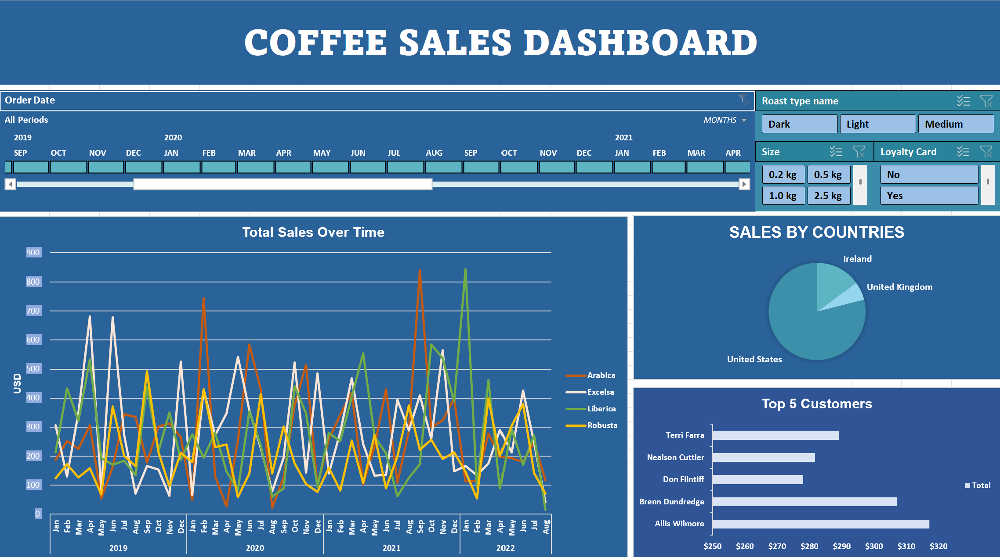

# Coffee-shop-Data-Analysis(Interactive Dashboard creation using MS Excel)
## Project Objective
The Coffee shop wants to analyze coffee sales data and build an interactive Excel dashboard to identify sales trends, top products, and customer purchasing patterns.

## Dataset used
- <a href="https://github.com/an-nguyen-data/coffee-sales-data-analysis/blob/main/coffeeOrdersDataProject.xlsx">Dataset<a/>

## Questions (KPIs)
-	Compare total sales and number of orders by month using a single chart.
-	Which month generated the highest sales and orders?
-	Which country contributes the most to total coffee sales?
-	What are the top 5 customers contributing to revenue?
-	Which coffee type generates the highest sales?
-	What is the relationship between roast type and total sales?
-	Which coffee size is ordered the most?
-	What is the distribution of sales by roast type?
-	What percentage of total sales comes from each coffee type?

-	Dashboard interaction <a href="https://github.com/an-nguyen-data/coffee-sales-data-analysis/blob/main/Dashboard_coffeesales.png">View Dashboard</a>

## Dashboard

## Project Insight
-	The United States contributes the highest total sales compared to other countries.
-	Excelsa coffee generates the highest revenue, followed by Liberica and Arabica.
-	The month with the highest sales shows strong customer demand during that period.
-	Customers tend to purchase medium and light roast coffee more frequently.
-	Medium size coffee products account for a large portion of total orders.

## Final conclusion:
To improve coffee sales, the business should focus on promoting high-performing coffee types such as Excelsa and Liberica, which generate the highest revenue. Since the United States contributes the largest share of sales, marketing efforts should prioritize this market. Additionally, offering promotions based on popular roast types and coffee sizes can help attract more customers and increase overall sales.
